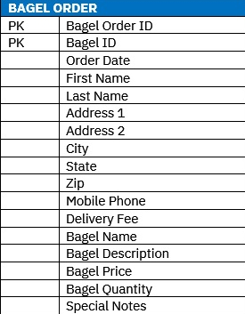
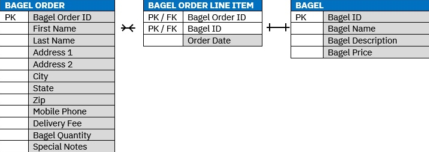
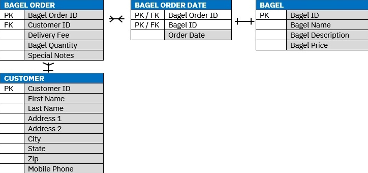
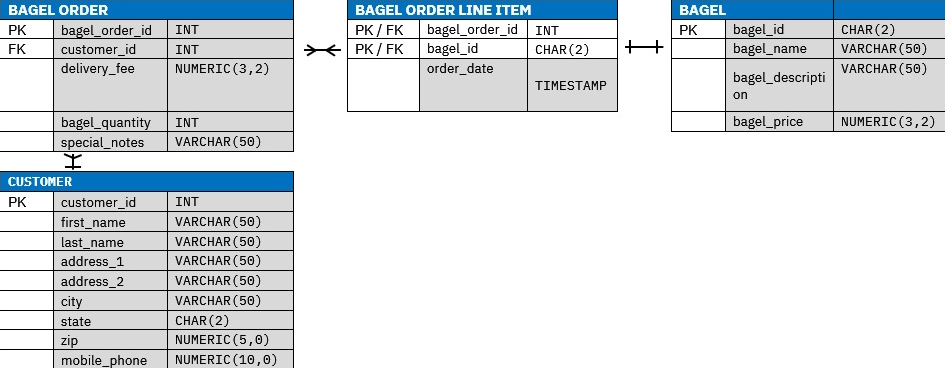

# Bagel Corner and Mister Coffee Database Management

## Introduction
This project, "Bagel Corner and Mister Coffee Database Management", focuses on developing and managing databases for two fictional businesses, Bagel Corner and Mister Coffee. It includes creating entity-relationship models, developing databases in MySQL, and writing SQL scripts for data manipulation and querying.

## Technologies Used
- MySQL

## Features
- Entity-Relationship (ER) Modeling
- Database Creation and Management in MySQL
- SQL Scripting for Data Insertion, Manipulation, and Querying
- Performance Optimization through Indexing and View Creation

## Installation Instructions
1. Install MySQL on your system.
2. Clone this repository.
3. Run the provided SQL script in MySQL to set up the database.

## Usage Instructions
- Use MySQL Workbench or a similar tool to interact with the database.
- Run the SQL scripts to create, manage, and query the database.

## Contributing
Contributions are welcome. Please fork the repository and submit a pull request for review.

## Bagel Corner Database Blueprints

### First Normal Form (1NF)

This 1NF table achieves the following:
- Captures all necessary data fields from the unnormalized “Bagel Corner Catering Order” form
- Excludes calculated fields like subtotal and sales tax as it is not necessary to store these values
- Establishes primary keys
- Does not contain any repeated groups (data that depends on both pieces of the composite primary key)	
- Contains only atomic data (no attributes will contain more than one piece of data)

### Second Normal Form (2NF)

In the 2NF stage, attributes are organized to reduce redundancy and dependency. The "Bagel Order" table holds unique order attributes, while "Bagel" and "Bagel Order Line Item" tables are structured to avoid duplicate information. The one-to-many relationship between "Bagel Order" and "Bagel Order Line Item" signifies that each order can have multiple line items, but each line item is linked to a single order. Similarly, the many-to-one relationship between "Bagel Order Line Item" and "Bagel" indicates that while a line item is associated with one type of bagel, a single bagel type can appear in multiple line items across orders.

### Third Normal Form (3NF)

The 3NF further refines the database design by ensuring that all tables contain only data directly related to each table's primary key. This step eliminates transitive dependency to ensure that data is stored in its most logical location. The relationships and cardinalities are defined by focusing on the essential elements that maintain the integrity and meaning of the data. For instance, the one-to-many relationship between customers and their bagel orders is established, ensuring each customer is linked to their unique orders, while a bagel order is associated with a single customer.

### Final Physical Database Model

## Mister Coffee Entity-Relationship Diagram

## License
[MIT License](LICENSE)