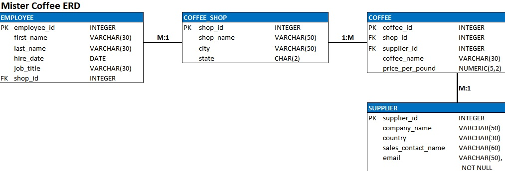

# Bagel Corner and Mister Coffee Database Management

This project aims to develop and manage databases for the fictional businesses Bagel Corner and Mister Coffee. It includes tasks such as creating entity-relationship models, constructing databases in MySQL, and scripting SQL for various data operations.

## Table of Contents

- [Languages Used](#languages-used)
- [Technologies Used](#technologies-used)
- [Features](#features)
- [Installation](#installation)
- [Usage](#usage)
- [Bagel Corner Database Blueprints](#bagel-corner-database-blueprints)
- [Mister Coffee Entity-Relationship Diagram](#mister-coffee-entity-relationship-diagram)
- [License](#license)

## Languages Used

- SQL

## Technologies Used

- MySQL

## Features

- Entity-Relationship (ER) Modeling for Bagel Corner and Mister Coffee.
- Database creation and management in MySQL.
- SQL scripting for data insertion, manipulation, and querying.
- Optimization of database performance through indexing and view creation.

## Installation

1. Install MySQL on your machine.
2. Clone the project repository.
3. Execute the included `bagel_corner_mister_coffee_db_script.sql` SQL script in MySQL to initialize the databases.

## Usage

- Interact with the databases using MySQL Workbench or a similar tool.
- Execute the SQL scripts to perform various database operations.

## Bagel Corner Database Blueprints

### Bagel Corner Orders

To see an example of a PDF form for orders placed with Bagel Corner: [Bagel Corner Catering Order Form](assets/bagel_corner_catering_order_form.pdf)

### 1st Normal Form (1NF)

### 2nd Normal Form (2NF)

### 3rd Normal Form (3NF)

### Final Database Model

## Mister Coffee Entity-Relationship Diagram

## License

[MIT License](LICENSE)
